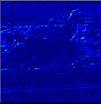
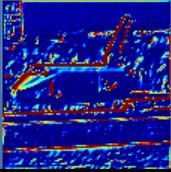

# News
The extractImagesFromBlob method has been integrated in a currated version to the dnn module of OpenCV thanks to the help and great reviews from @dkurt and @vpisarev. See OpenCV >= 3.4.1, method dnn::imagesFromBlob.
-----------------------------------------------------------------------------------------------------------------------------------------
-----------------------------------------------------------------------------------------------------------------------------------------
### A New tutorial using the method dnn::imagesFromBlob is now available at https://github.com/Pandinosaurus/visualizeDnnBlobsOCV
-----------------------------------------------------------------------------------------------------------------------------------------
-----------------------------------------------------------------------------------------------------------------------------------------

# Presentation
A sample code to visualize with OpenCV the deep learning blobs generated with the OpenCV dnn module.

## Purpose :
An easy way to visualize the output blobs of each layer of a Deep Convolutional Neural Network with OpenCV.(https://github.com/opencv/opencv).

With per feature map normalization :

With Nvidia Digits like normalization :

## Why :
OpenCV (3.4) already provides the dnn module. 
The dnn module allows you to load a network trained with a dedicated framework/library (e.g. caffe, tensorflow) in OpenCV. It also allows you to catch each output of each layer when you perform a forward pass through the forward() method.
The ouptut of each layer is returned in a data structure named "blob".
A blob is a 4 dimensional array stored in an OpenCV Mat objet (cv::Mat). 
You can't display a blob trivialy with cv::imshow() except for the output of the "prob" layer (at least with the Googlenet network). 
If you want to see the result of a given layer, you need to extract the images stored in its output blob(s).

## What it does :
In essence, this program demonstrates how to extract the images from the "blobs". 
It generates one cv::Mat per filtered image per layer (e.g. per convolutional filter in a convolutional layer).  
You can use the resulting cv::Mat images as you have the habit to do in OpenCV. 
It allows you to display/store/save/study/understand the results of each layer direclty in OpenCV.
In this code sample, an example is provided with the GoogleNet model from the Caffe Model Zoo.

## What it does not :
It does not demonstrate how to classify an image in OpenCV with a trained network.
See the offical OpenCV documentation for the DNN module for a classification tutorial : https://docs.opencv.org/trunk/d5/de7/tutorial_dnn_googlenet.html.

## Requirements :
### Compile :
	- CMake (version >= 2.8)
### Libraries :
	- OpenCV (version >= 3.4)
### OS :
	- Windows 10 with Visual Studio 2017 (msvc2015_64)
	- Unix with Makefiles
### Data :
	- The /data/ folder provides you with almost everything you need to get started but the trained model (bvlc_googlenet.caffemodel). 
	You can download it from : http://dl.caffe.berkeleyvision.org/bvlc_googlenet.caffemodel
	Once downloaded, put it in the /data/ folder.
